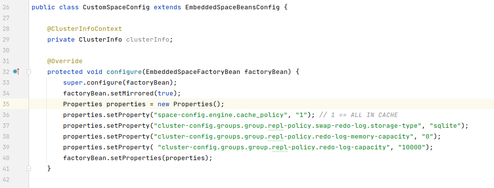
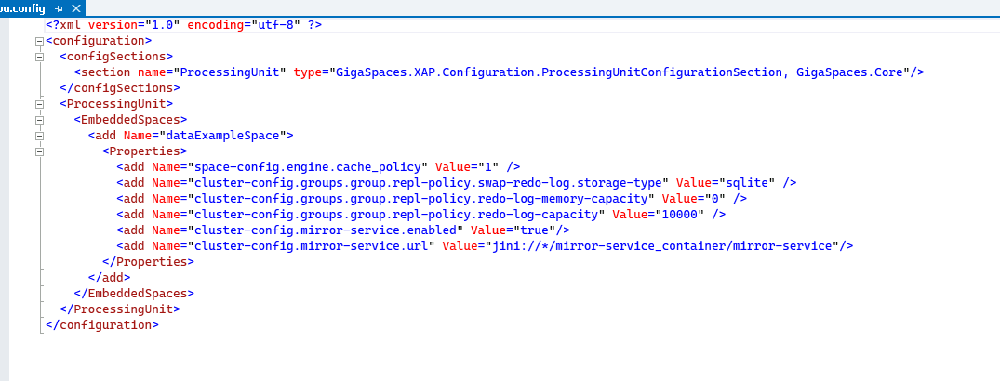
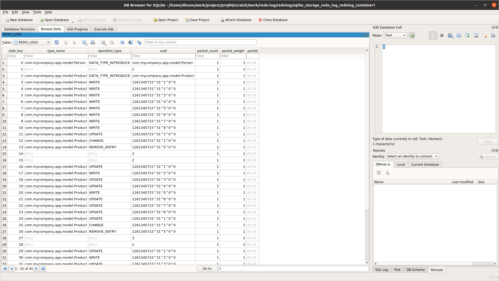

# redolog

## Introduction and Process Flow

 * This is a Java project that allows you to flush the redolog and transform the redolog into a format that is readable (yaml).
 * The yaml contents can then be processed with a .NET client to replay the redo log operations back to the space. This portion is demonstrated in the **dotnet-redolog/ReadRedoLogContents** folder (a separate sub-directory). Replaying the operations serves the purpose of writing the contents to the space where they can then be persisted to the database.
 * The main portions of this project can be found in the redolog-client module. The other modules such as `my-app-model` and `my-app-space` are useful for demonstration purposes.

## Overview
 * For demonstration purposes, we will describe all the steps to utilize the redo log.
 * The steps include 1. Deploying a space and writing data into the space 2. Flushing the redo log to disk 3. Deserializing the redo log contents.
 * This solution would also include a mirror. But for now, we are demonstrating what happens when the mirror is not available.
 * This example demonstrates with a space with one partition. For multiple partitions you should run FlushRedoLogToDisk per each redolog file on all machines.

## How to Run
### 1. Deploying the space and writing data into the space
1. Start a grid with 2 GSC `./gs.sh host run-agent --auto --gsc=2`
2. Deploy my-app-space (1 partition with ha) `./gs.sh pu deploy --partitions=1 --ha my-app-space-pu $PROJ_DIR/my-app-space/target/my-app-space-1.0-SNAPSHOT.jar`
3. Have a look at Feeder in the redolog-client module.
4. Run the Feeder. One way to do this is to run from the Intellij IDE. Copy the entire runConfigurations folder into the Intellij .idea folder (the .idea folder gets created when you open the Maven project in Intellj). You will then need to restart Intellij. You should then be able to select the run configuration and run from the IDE.

#### Space Configuration
This section describes key configuration points for the space in support of writing the redo log to disk.

Below is a screenshot of the space configurations needed to write the redo to disk.



* This is a space that supports a mirror. In the process of writing to the mirror, items are written to the replication redo log. From there, items are consumed by the mirror and written to the DBMS.
* `cluster-config.groups.group.repl-policy.swap-redo-log.storage-type` this is set to `sqlite`. This instructs the space to also write the redo logs to disk.
* `cluster-config.groups.group.repl-policy.redo-log-memory-capacity`. This is set to `0`. Setting this ensures all replication packets are written to disk.

Below is a screenshot of the space configurations when deployed on .NET.



#### Check the redo log size and space data
1. Check the redolog size in GigaSpaces. For more information see: [How to Monitor the Redo Log Size](https://docs.gigaspaces.com/latest/admin/controlling-the-replication-redo-log.html#MonitoringtheRedoLogSize)
2. Examine the space data. One way to do this is to query the data and to export the query results. See: [How to Query the Space](https://docs.gigaspaces.com/latest/admin/admin-query-space.html?#QueryaSpace) 

### 2. FlushRedoLogToDisk
Have a look at `FlushRedoLogToDisk.java` in the edolog-client module. It runs a distributed task, `FlushRedoLogTask.java`. It in turns calls an admin method`flushRedoLogToStorage()`.

It requires the name of the space passed as a program argument. The `GS_LOOKUP_LOCATORS` and `GS_LOOKUP_GROUPS` are set via System properties. These are needed to connect to the space.

1. Run FlushRedoLogToDisk. It can be run from the IDE, like the way the Feeder was run previously, or it can be run with the helper script `dotnet-redolog/redolog/redolog-client/src/main/resources/run.sh`.

**Important**
Although the redo log operations are continually being written to the disk. We need to run the flush to flush the **code map**. The code map is metadata that is used to describe what operations might be found in the the redo log and will be used in the deserialization of the redo log operations.

#### Viewing the redo log in Sqlite

1. Install SQLite browser https://sqlitebrowser.org/dl/
2. Open SQLite browser with file: `gs-home/work/redo-log/<name_of_space>/sqlite_storage_redo_log_<name_of_space>_container1` (name_of_space is the name of the space)



Note: The contents of the SQLite database are in serialized format that the redo log understands and are not the actual objects. By default, the filename with suffix `container1` will contain the redo log information, but if during the active election process the backup was promoted to primary, the filename with suffix `container1_1` will contain the redo log information.

### 3. DeserializeRedoLog

1. Copy files under `gs-home/work/redo-log/<name_of_space>` to a backup location, e.g. `$HOME/backup/work/redo-log/<name_of_space>`
2. Shutdown the grid
3. Run `DeserializeRedoLog.java`.

It takes the command line arguments:
```
--spaceName=<name_of_space> --containerName=<name_of_space>_container[1|1_1] --outputFileName=<path/to/output/yaml/file>
```

It takes as a System Property the location of the backed up redo log files. For example, `-Dcom.gs.home=${HOME}/backup`

## Conclusion

This concludes the tasks of flushing the redolog and transforming the redolog into a readable yaml format.

Please continue with the **dotnet-redolog/ReadRedoLogContents** to write the deserialized content back to the space.
